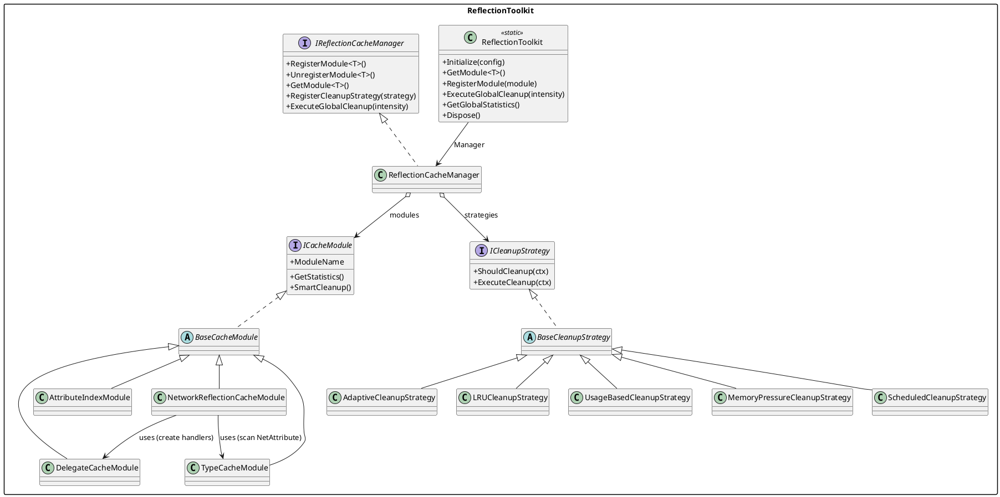
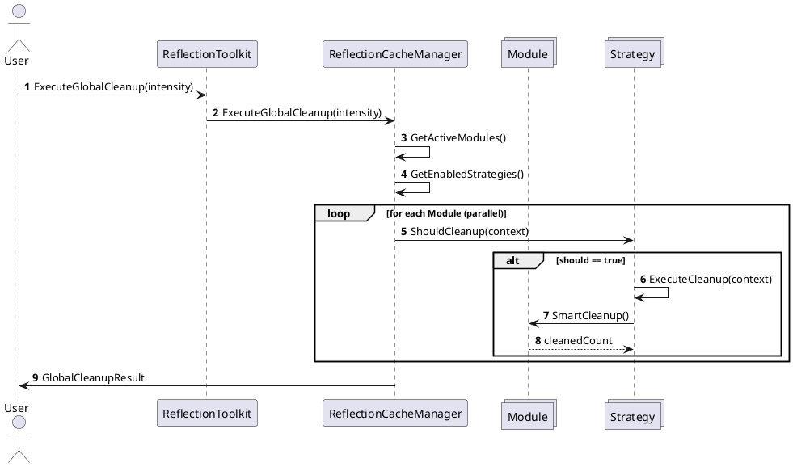
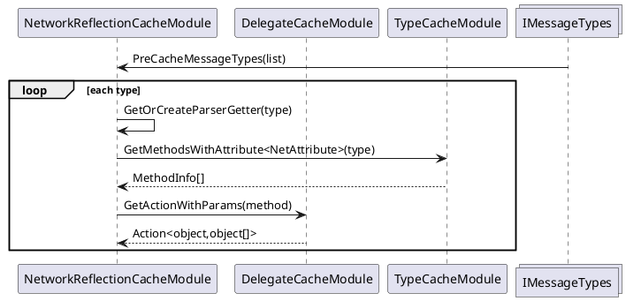

# ReflectionToolkit 文档


---
## 1. 设计目标

ReflectionToolkit 旨在对 **反射相关的高频操作**（类型查找、MethodInfo/PropertyInfo/字段/特性/委托解析、网络消息映射等）提供：

- 高性能：集中式缓存 + 并发安全 + 智能清理
- 可观测：统一统计结构（命中率 / 内存使用 / 使用频率 / 清理结果）
- 可扩展：模块化 ICacheModule，策略化 ICleanupStrategy，可插拔
- 自适应：全局策略组合 + 模块内部 OnSmartCleanup 双层裁剪
- 可维护：统一入口 `ReflectionToolkit`，分层清晰（Core / Interfaces / Modules / Strategies）
- 可控内存：LRU / 使用频率 / 内存压力 / 定时 / 自适应 多策略叠加

---
## 2. 架构概览

```
ReflectionToolkit (静态外观层)
  └── ReflectionCacheManager (核心调度/聚合)
        ├── Modules (实现 ICacheModule)
        │     ├── TypeCacheModule              (类型/成员/特性/构造/重载缓存)
        │     ├── DelegateCacheModule          (委托创建与绑定缓存)
        │     ├── AttributeIndexModule         (按 Attribute 反向索引 Type / Method)
        │     ├── NetworkReflectionCacheModule (网络消息/处理函数映射)
        │     └── … (可扩展自定义模块)
        ├── Strategies (实现 ICleanupStrategy)
        │     ├── LRUCleanupStrategy
        │     ├── UsageBasedCleanupStrategy
        │     ├── MemoryPressureCleanupStrategy
        │     ├── ScheduledCleanupStrategy
        │     ├── AdaptiveCleanupStrategy
        │     └── … (自定义策略)
        ├── 全局事件: 模块注册/注销, 清理完成, 统计变化
        └── 计时/性能计数器/自动清理定时器
```

### 2.1 分层说明
| 层 | 说明 | 关键职责 |
|----|------|----------|
| 外观层 | `ReflectionToolkit` | 初始化、统一 API、注册默认模块+策略、便捷方法、报告输出 |
| 核心层 | `ReflectionCacheManager` | 模块/策略生命周期、并行全局清理、统计聚合、自动任务 |
| 接口层 | `ICacheModule` / `ICleanupStrategy` / `IReflectionCacheManager` / 配置结构 | 约束扩展点，形成统一协议 |
| 模块层 | 具体缓存域 | 封装某类反射数据的加载、缓存、命中统计、内部智能清理 |
| 策略层 | 清理策略组合 | 基于上下文/内存/命中率/频率的触发与执行逻辑 |
| 诊断层 | 统计/报告 | 提供开发 & 运维可视化入口（字符串报告 + 结构体）|

### 2.2 数据流简述
1. 业务侧调用 `ReflectionToolkit.*`（如 GetModule / ExecuteGlobalCleanup / GetDetailedCacheReport）。
2. 若首次访问触发 `Initialize()`：注册默认模块与策略。 
3. 模块提供具体缓存接口（如 `TypeCacheModule.GetMethod`）。访问时：
   - 命中 => 更新使用计数与时间；记录 Hit
   - 未命中 => 反射解析 + 写入缓存；记录 Miss
4. 定时器或人工触发全局清理：
   - `ReflectionCacheManager.ExecuteGlobalCleanup` 并行遍历模块
   - 构建 `CleanupContext` 依次调用策略 `ShouldCleanup` → `ExecuteCleanup`
   - 策略内部调用模块的 `SmartCleanup()`（转到模块内部 `OnSmartCleanup` 细粒度裁剪）
   - 汇总 `GlobalCleanupResult`
5. 用户可随时获取 `GlobalCacheStatistics` 或 `GetDetailedCacheReport()`。

---
## 3. 运行流程 (时序)

### 3.1 初始化流程
```
ReflectionToolkit.Manager (lazy) → Initialize(config)
  → new ReflectionCacheManager(config)
    → Initialize 性能计数器
  → RegisterDefaultModules()
  → RegisterDefaultCleanupStrategies()
  → StartAutoCleanup(若配置启用)
```

### 3.2 缓存访问流程（以获取重载方法为例）
```
GetMethod(type, name, params) → 拼接签名 key → ConcurrentDictionary.TryGetValue
  → 命中: TrackUsage + RecordCacheHit() → 返回 MethodInfo
  → 未命中: type.GetMethod(...) → 加入缓存 → TrackUsage → RecordCacheHit()
  → 失败: RecordCacheMiss()
```

### 3.3 全局清理流程
```
ExecuteGlobalCleanup(intensity)
  → 收集 active modules + enabled strategies (按优先级排序)
  → 并行 ForEach module:
       baseStats = module.GetStatistics()
       For strategy in strategies:
           context = new CleanupContext(baseStats, intensity, memoryPressure,...)
           if strategy.ShouldCleanup(context):
                result = strategy.ExecuteCleanup(context)
                (内部→ module.SmartCleanup() → OnSmartCleanup 多维度剔除)
       聚合模块清理结果
  → 归约 total cleaned / freed memory / time
  → 触发 OnGlobalCleanupCompleted
```

### 3.4 自动清理自适应强度
```
Timer Tick → GetSystemMemoryPressure()
  memoryPressure >80 → Aggressive
  >60 → Normal
  else → Light
→ ExecuteGlobalCleanup(强度)
```

---
## 4. 关键接口与结构 (API Reference)

### 4.1 IReflectionCacheManager
| 成员 | 说明 |
|------|------|
| RegisterModule<T>() | 注册模块（覆盖同类型） |
| UnregisterModule<T>() | 注销模块 |
| GetModule<T>() | 获取模块实例 |
| RegisterCleanupStrategy() | 注册清理策略 |
| UnregisterCleanupStrategy(name) | 注销清理策略 |
| ExecuteGlobalCleanup(intensity) | 触发全局策略清理 |
| GetGlobalStatistics() | 获取全局聚合统计 |
| ClearAllCaches() | 清空所有缓存 |
| GetAllModules() | 列出所有注册模块 |
| GetAllStrategies() | 列出所有策略 |
| SetGlobalConfiguration() | 热切换配置 |
| StartAutoCleanup(interval) | 启动自动清理定时器 |
| StopAutoCleanup() | 停止自动清理 |
| 事件(OnModuleStatisticsChanged, OnGlobalCleanupCompleted, OnModuleRegistered, OnModuleUnregistered) | 订阅运维指标 |

### 4.2 ICacheModule
| 成员 | 说明 |
|------|------|
| ModuleName | 模块名 |
| Priority | 全局调度优先级（降序）|
| IsEnabled | 是否参与调度 |
| GetStatistics() | 返回 `CacheStatistics` |
| ClearCache() | 清空模块缓存 |
| SmartCleanup() | 调用内部 `OnSmartCleanup` 返回清理条数 |
| WarmupCache() | 预热常用数据 |
| GetMemoryUsage() | 估算内存字节 |
| Initialize() / Dispose() | 生命周期 |
| 事件 OnCacheHitRateChanged / OnCacheCleanupCompleted | 观测扩展 |

`CacheStatistics` 字段：TotalItems / HitCount / MissCount / HitRate / MemoryUsage / LastCleanupTime / AverageUsageFrequency / MemoryPressureLevel / ExtendedStats。

### 4.3 ICleanupStrategy & BaseCleanupStrategy
| 成员 | 说明 |
|------|------|
| StrategyName / Priority / IsEnabled | 标识 + 调度控制 |
| ShouldCleanup(context) | 是否触发 |
| ExecuteCleanup(context) | 返回 `CleanupResult` |
| Get/SetConfiguration() | 读取/更新参数化配置 |

`CleanupContext`：TargetModule / CurrentStats / SystemMemoryPressure / ExtendedData / CleanupIntensity / MaxCleanupItems。

`CleanupResult`：WasExecuted / CleanedItemsCount / FreedMemoryBytes / ExecutionTimeMs / StrategyName / ExtendedResults / ErrorMessage。

### 4.4 主要模块补充 API

#### TypeCacheModule
| 方法 | 说明 |
|------|------|
| TryGetType(typeName,out Type) | 多程序集查找并缓存类型 |
| GetType(typeName) | 上述封装，找不到 null |
| GetMethod(type,name,flags) | 旧逻辑（首个匹配） |
| GetMethod(type,name,Type[] params,flags) | 重载精确匹配缓存 |
| GetProperty(type,name,flags) | 属性缓存 |
| GetField(type,name,flags) | 字段缓存 |
| GetCustomAttributes<T>(Type, inherit) | 类型特性缓存 |
| GetMethodCustomAttributes<T>(MethodInfo, inherit) | 方法特性缓存 |
| GetFieldCustomAttributes<T>(FieldInfo, inherit) | 字段特性缓存 |
| GetMethodsWithAttribute<T>(Type, flags) | 带特性的方法集合缓存 |
| GetConstructor(Type, params Type[]) | 构造函数精确匹配缓存 |
| SmartCleanup() | 多维度驱逐(空闲/低频/内存/批量) |

(其它模块例如 `DelegateCacheModule`, `AttributeIndexModule`, `NetworkReflectionCacheModule` 可按类似格式扩展——若需要可在后续补全深入 API 表。)

#### DelegateCacheModule
核心作用：把反射 Method/Property/Constructor 访问转换为已编译表达式树委托，降低 `MethodInfo.Invoke` 等调用开销；并提供“手动”动态委托缓存能力。

| 分类 | 方法/成员 | 签名 (简) | 说明 |
|------|-----------|-----------|------|
| 方法委托 | GetAction | Action<object> GetAction(MethodInfo) | 无参实例/静态方法委托（失败回退反射） |
| 方法委托 | GetActionWithParams | Action<object,object[]> GetActionWithParams(MethodInfo) | 有参数方法委托 |
| 方法委托 | GetFunc | Func<object,object[],object> GetFunc(MethodInfo) | 有返回值方法委托 |
| 属性委托 | GetGetter | Func<object,object> GetGetter(PropertyInfo) | Getter 委托（支持静态）|
| 属性委托 | GetSetter | Action<object,object> GetSetter(PropertyInfo) | Setter 委托（支持静态）|
| 构造委托 | GetConstructor | Func<object[],object> GetConstructor(ConstructorInfo) | 构造函数快速实例化 |
| 手动缓存 | GetOrCreateDelegate | Action<object,object[]> GetOrCreateDelegate(object, Func<Action<object,object[]>>) | 任意 key 的自定义委托（可工厂缓存） |
| 手动缓存 | PreRegisterDelegate | void PreRegisterDelegate(object, Action<object,object[]>) | 预注入委托 |
| 手动缓存 | PreRegisterDelegates | void PreRegisterDelegates(IEnumerable<KeyValuePair<object,Action<object,object[]>>>) | 批量预注入 |
| 手动缓存 | RemoveDelegate | bool RemoveDelegate(object) | 移除指定 key 委托 |
| 手动缓存 | ContainsDelegate | bool ContainsDelegate(object) | 是否存在 |
| 手动缓存 | GetDelegateStats | ManualDelegateCacheStats GetDelegateStats() | 获取手动委托统计 |
| 配置 | ManualConfiguration | get/set ManualDelegateCacheConfiguration | 手动委托缓存参数 |
| 校验 | ManualKeyValidator | Func<object,bool> ManualKeyValidator | 自定义 key 验证（返回 false 拒绝缓存）|
| 统计扩展 | (ExtendedStats) | 字典 | 各类委托数量 / 手动委托用量等 |

ManualDelegateCacheConfiguration: UnusedDelegateThresholdMinutes / MaxDelegateCount / MinUsageThreshold / MaxMemoryUsageMB / EnableFactoryCache。

ManualDelegateCacheStats: TotalDelegates / TotalUsage / AverageUsage / RecentlyUsed / OldDelegates / MemoryPressureLevel。

清理特点：`OnSmartCleanup` 三阶段驱逐（长时间未使用→低频→内存压力 LRU 近似）。

#### AttributeIndexModule
核心作用：维护 AttributeType → Types 以及 AttributeType → (Type, Attribute实例) 索引；支持增量添加 / 删除、快速数组快照缓存与事件广播。

| 分类 | 方法/成员 | 签名 (简) | 说明 |
|------|-----------|-----------|------|
| 写入 | AddAttributeAndType | void AddAttributeAndType(Dictionary<Type,HashSet<Type>>, Dictionary<Type,HashSet<TypeAndAttribute>>) | 批量合并两个映射集 |
| 写入 | Add | void Add(IEnumerable<Type>) | 解析类型上的 BaseAttribute 并建立映射 |
| 写入 | Remove | bool Remove(Type) | 移除某类型所有特性映射 |
| 写入 | RemoveAttribute | bool RemoveAttribute(Type attrType, Type type) | 移除特定 (特性,类型) 映射 |
| 查询 | GetTypesWithAttribute | HashSet<Type> GetTypesWithAttribute(Type) | 拥有该特性集合 (原始 HashSet 副本) |
| 查询 | GetTypesAndAttribute | HashSet<TypeAndAttribute> GetTypesAndAttribute(Type) | 获取绑定集合 |
| 快速 | GetTypesWithAttributeFast | IReadOnlyList<Type> GetTypesWithAttributeFast(Type) | 数组快照（内部缓存）|
| 快速 | GetTypesAndAttributeFast | IReadOnlyList<TypeAndAttribute> GetTypesAndAttributeFast(Type) | 绑定数组快照 |
| 泛型 | GetTypesWithAttributeFast<T> | IReadOnlyList<Type> | typeof(T) 快速封装 |
| 泛型 | GetTypesAndAttributeFast<T> | IReadOnlyList<TypeAndAttribute> | typeof(T) 快速封装 |
| 事件 | OnAttributeMappingAdded | event Action<Type,Type> | 新增映射通知 |
| 事件 | OnAttributeMappingRemoved | event Action<Type,Type> | 移除映射通知 |
| 事件 | OnTypeRemoved | event Action<Type> | 类型所有映射被清空 |
| 统计 | (ExtendedStats) | 字典 | 各映射字典/数组缓存数 |
| 清理 | SmartCleanup | 返回 0 | 本模块不做自动裁剪（显式维护）|

TypeAndAttribute：封装 (Type, Attribute) 并重写 Equals/GetHashCode 做等价去重。

#### NetworkReflectionCacheModule
核心作用：围绕网络消息（Protobuf）加速：消息处理方法委托、Parser 获取、消息 ID 缓存、NetAttribute 方法扫描。

| 分类 | 方法/成员 | 签名 (简) | 说明 |
|------|-----------|-----------|------|
| 消息处理 | GetOrCreateMessageHandler | Action<object,object[]> GetOrCreateMessageHandler(MethodInfo) | MethodInfo → 高性能委托 |
| Parser | GetOrCreateParserGetter | Func<MessageParser> GetOrCreateParserGetter(Type) | 静态 Parser 属性委托 |
| 消息ID | CacheMessageId | void CacheMessageId(Type, short) | 缓存类型到消息ID |
| 消息ID | GetCachedMessageId | short GetCachedMessageId(Type) | 缓存ID，未命中 -1 |
| Net特性 | GetOrCreateNetAttributeMethods | MethodInfo[] GetOrCreateNetAttributeMethods(Type) | 缓存 NetAttribute 方法数组 |
| 预热 | PreCacheMessageTypes | void PreCacheMessageTypes(IEnumerable<Type>) | 批量预构建 Parser / 方法缓存 |
| 预热钩子 | OnWarmupCache | override | 自动扫描并预热前 N 个 IMessage 类型 |
| 配置 | Configuration | NetworkCacheConfiguration | 模块独立配置 |
| 统计扩展 | (ExtendedStats) | 字典 | 处理器/Parser/ID/Net方法计数 + 平均使用频率 |
| 清理 | SmartCleanup | override | 未使用阈值 + 低频 + 容量限制 多条件清理 |

NetworkCacheConfiguration: UnusedCacheThresholdMinutes / MaxCacheItems / MinUsageThreshold / WarmupMessageTypeCount / EnableAutoParserPreCache / EnableMessageIdPreCache。

### 4.5 ReflectionToolkit (外观层)
| 方法 | 说明 |
|------|------|
| Initialize([config]) | (Lazy) 初始化并注册默认模块/策略 |
| RegisterModule / GetModule / UnregisterModule | 透传到 Manager |
| RegisterCleanupStrategy / UnregisterCleanupStrategy | 透传到 Manager |
| ExecuteGlobalCleanup(intensity) | 全局清理并返回结果 |
| GetGlobalStatistics() | 聚合统计结构体 |
| GetDetailedCacheReport() | 生成详细文本报告 |
| GetPerformanceMonitorInfo() | 输出模块与策略注册信息 |
| SetGlobalConfiguration(config) | 热切换配置并重建定时器 |
| Start/StopAutoCleanup(interval) | 启动/停止自动任务 |
| ClearAllCaches() | 清空所有模块缓存 |
| WarmupAllCaches() | 调用每个模块预热 |
| GetMemoryUsageSummary() | 内存摘要字符串 |
| SubscribeToGlobalCleanup(handler) / Unsubscribe... | 事件订阅辅助 |
| Dispose() | 释放所有资源 |

---
## 5. 使用说明

### 5.1 快速开始
```csharp
// ① 首次使用前 (可省略，首次访问 Manager 自动初始化)
ReflectionToolkit.Initialize(new DefaultReflectionCacheConfiguration
{
    AutoCleanupInterval = TimeSpan.FromMinutes(5),
    MemoryPressureThreshold = 150, // 150 MB
    MaxCacheItems = 20000,
    DefaultCleanupIntensity = CleanupIntensity.Normal,
    EnableStatistics = true,
    EnablePerformanceMonitoring = true
});

// ② 获取类型/方法
var typeModule = ReflectionToolkit.GetModule<TypeCacheModule>();
var listType = typeModule.GetType("System.Collections.Generic.List`1");
var addMethod = typeModule.GetMethod(listType, "Add", new[]{ typeof(int) });

// ③ 订阅全局清理事件
ReflectionToolkit.SubscribeToGlobalCleanup(result =>
{
    Log.SystemLog($"清理完成: {result.TotalCleanedItems} 项, 释放 {result.TotalFreedMemory/1024}KB");
});

// ④ 手动触发一次清理
var cleanupResult = ReflectionToolkit.ExecuteGlobalCleanup(CleanupIntensity.Aggressive);

// ⑤ 输出报告
var report = ReflectionToolkit.GetDetailedCacheReport();
Log.SystemLog(report);
```

### 5.2 自定义模块
```csharp
public class MyCustomModule : BaseCacheModule
{
    public override string ModuleName => "MyCustom";
    private readonly ConcurrentDictionary<string, object> _cache = new();

    public object GetOrAdd(string key, Func<object> loader)
    {
        if (_cache.TryGetValue(key, out var val)) { RecordCacheHit(); return val; }
        val = loader();
        _cache[key] = val; RecordCacheMiss(); return val;
    }

    protected override void OnClearCache() => _cache.Clear();
    protected override int OnSmartCleanup()
    {
        // 示例：清理一半条目
        int removed = 0; var toRemove = _cache.Keys.Take(_cache.Count/2).ToList();
        foreach (var k in toRemove) if (_cache.TryRemove(k, out _)) removed++;
        return removed;
    }
    protected override int GetCacheItemCount() => _cache.Count;
    public override long GetMemoryUsage() => _cache.Count * 128; // 估算
    protected override Dictionary<string, object> GetExtendedStatistics() => new() { ["自定义缓存数"] = _cache.Count };
}

// 注册
ReflectionToolkit.RegisterModule(new MyCustomModule());
```

### 5.3 自定义清理策略
```csharp
public class PeakHourCleanupStrategy : BaseCleanupStrategy
{
    public override string StrategyName => "PeakHour";
    public PeakHourCleanupStrategy() { Priority = 120; }
    protected override bool OnShouldCleanup(CleanupContext context)
    {
        var hour = DateTime.Now.Hour;
        return hour is >= 20 or < 2; // 晚高峰或凌晨回收
    }
    protected override CleanupResult OnExecuteCleanup(CleanupContext context)
    {
        var sw = System.Diagnostics.Stopwatch.StartNew();
        var cleaned = context.TargetModule.SmartCleanup();
        sw.Stop();
        return CleanupResult.Success(StrategyName, cleaned, 0, sw.ElapsedMilliseconds);
    }
    protected override ICleanupConfiguration CreateDefaultConfiguration() => new CleanupConfiguration("PeakHour");
}

// 使用
ReflectionToolkit.RegisterCleanupStrategy(new PeakHourCleanupStrategy());
```

### 5.4 热切换配置
```csharp
var newConfig = new DefaultReflectionCacheConfiguration
{
    AutoCleanupInterval = TimeSpan.FromMinutes(2),
    MemoryPressureThreshold = 120,
    MaxCacheItems = 30000
};
ReflectionToolkit.SetGlobalConfiguration(newConfig);
```

### 5.5 生成报告与监控
```csharp
Log.SystemLog(ReflectionToolkit.GetPerformanceMonitorInfo());
Log.SystemLog(ReflectionToolkit.GetDetailedCacheReport());
```

---
## 6. 示例场景
| 场景 | 做法 | 价值 |
|------|------|------|
| 大量反射构造委托 | 使用 DelegateCacheModule（假定存在相应 API） | 减少重复表达式树/IL 生成开销 |
| 行为分发 (Attribute 标记) | AttributeIndexModule + TypeCacheModule.GetMethodsWithAttribute | 加速方法扫描与按特性筛选 |
| 网络协议注册 | NetworkReflectionCacheModule | 统一消息 ID → 处理函数映射缓存 |
| 频繁热更/清理 | 手动定期调用 ExecuteGlobalCleanup | 控制内存峰值 |
| 低内存设备 | 提高 AutoCleanup 频次 + 降低 MemoryPressureThreshold | 降低崩溃风险 |

---
## 7. 统计与诊断

### 7.1 全局统计字段 (GlobalCacheStatistics)
- ModuleStatistics: 每模块 CacheStatistics 字典
- TotalCacheItems / TotalMemoryUsage
- GlobalHitRate
- ActiveModuleCount
- SystemMemoryPressure (字符串级别：高/中/低/正常)
- LastUpdateTime

### 7.2 CacheStatistics 扩展字段 (ExtendedStats) 示例 (TypeCacheModule)
- 类型缓存数 / 方法缓存数 / 方法重载缓存数 / 属性缓存数 / 字段缓存数
- 类型特性缓存数 / 方法特性缓存数 / 字段特性缓存数 / 带特性的方法缓存数 / 构造函数缓存数
- 总使用次数

### 7.3 CleanupResult.ExtendedResults 可能包含
- StrategyPriority / LastExecutionTime / TotalCleanedItems / TotalExecutionTime
- 各策略特定参数（如 LRU: MaxAgeMinutes, CleanupRatio; UsageBased: MinUsageThreshold 等）

---
## 8. 性能考量
| 优化点 | 说明 |
|--------|------|
| 并发结构 | 使用 ConcurrentDictionary 避免锁竞争（读多写少场景） |
| 双层清理 | 全局策略 + 模块内部 OnSmartCleanup (局部特性) |
| 策略整合 | 多策略聚合只统计一次基础统计，避免重复昂贵计算 |
| 延迟初始化 | 仅首次访问 Manager 时构建资源 |
| 批量裁剪 | 模块内部对空闲/低频使用批量裁剪减少长尾碎片 |
| 轻量估算 | 内存与项大小估算简化，避免 GC 压力与反射二次反射 |

---
## 9. 可扩展点与建议优化

### 9.1 可扩展点
- 新增缓存域：实现 `BaseCacheModule` 并注册
- 新增清理策略：继承 `BaseCleanupStrategy`
- 自定义配置：实现 `IReflectionCacheConfiguration` 以支持外部热加载 JSON / ScriptableObject
- 统计持久化：将 `GlobalCacheStatistics` 输出到日志/监控系统（Prometheus / InfluxDB）

### 9.2 未来优化潜力
| 方向 | 建议 |
|------|------|
| 精准内存统计 | 结合 GC.GetTotalMemory / 对象采样或 Source Generator 估计模型 |
| 策略决策学习化 | 引入简单反馈环 (命中率下降 → 提高策略触发频率) |
| 热 Key 保护 | SmartCleanup 添加热点 Key 白名单避免误删 |
| 分层缓存 | 引入二级缓存（短期 L1 + 长期 L2）降低抖动 |
| 线程亲和 | 大量反射构建场景采用本地 thread-local 暂存再合并 |
| Unity 构建剔除 | 条件编译 #if UNITY_EDITOR 过滤仅编辑期策略或诊断逻辑 |
| 代码生成 | 对热点反射路径生成强类型访问器（Roslyn Source Generator）|

### 9.3 风险与注意事项
| 风险 | 说明 | 缓解 |
|------|------|------|
| 误删活跃项目 | 过度激进清理策略 | 调低 Aggressive 频率；提供白名单 |
| 统计开销 | 高频调用 GetStatistics 触发遍历 | 生产模式降低统计频率或缓存快照 |
| 反射加载抖动 | 瞬时大量并发未命中 | 可以加预热或批量注册方法映射 |
| 内存估算不准 | 估算 *100 字节 | 后期引入抽样或可插拔估算器 |

---
## 10. FAQ (精选)
| 问题 | 答案 |
|------|------|
| 为什么策略里还调用 module.SmartCleanup()? | 保留模块内部领域知识（不同模块裁剪规则差异大）+ 全局统一调度 |
| 可以只用模块内部清理不用策略吗？ | 可以：不注册任何策略时手动调用各模块 SmartCleanup()；或写一个简单 PassThrough 策略 |
| 如何彻底释放所有缓存？ | 调用 `ReflectionToolkit.ClearAllCaches()` 或 `Dispose()` |
| 如何关闭统计？ | 配置 `EnableStatistics = false` （需在模块实现里遵守该标志—当前实现主要用于外部判断输出）|
| 如何防止热更后旧类型残留？ | 可在热更完成后执行一次 `Aggressive` 或 `Force` 全局清理 |

---
## 11. 版本语义与命名建议
- Module 命名统一以 `*CacheModule` 结尾
- 策略命名以 `*CleanupStrategy` 结尾
- 公共新增字段/方法需补充 XML 注释（避免重复）

---
## 12. 附录：术语表
| 术语 | 说明 |
|------|------|
| Hit / Miss | 命中 / 未命中次数 |
| SmartCleanup | 模块内部的“智能”裁剪逻辑入口 |
| CleanupStrategy | 可组合的全局清理策略对象 |
| CleanupIntensity | Light / Normal / Aggressive / Force |
| ExtendedStats | 模块特定扩展统计字典 |
| ExtendedResults | 策略执行扩展结果字典 |

---
## 13. 更新记录
| 日期 | 描述 |
|------|------|
| 2025-09-25 | 初稿创建，覆盖架构、流程、核心 API、使用示例、优化建议 |

---
如需：
1) 更详细的各模块 API 表格（Delegate / Network / AttributeIndex）
2) UML 类图 (PlantUML) 
3) 自动化统计导出（如 JSON）
请在后续提出，我会继续补充。

---
## 14. PlantUML 类图与时序图

> 以下为可复制到 `*.puml` 的 PlantUML 描述，用于生成架构与关键流程图。你可在文档目录新增 `.puml` 文件或粘贴到在线 PlantUML 渲染器。

### 15.1 顶层类图


### 15.2 全局清理时序图


### 15.3 Delegate 调用加速（方法调用）
```plantuml
@startuml
actor Caller
participant DelegateCacheModule as D
entity MethodInfo as M

Caller -> D : GetActionWithParams(M)
alt cache hit
  D --> Caller : cached delegate
else miss
  D -> D : CreateActionWithParams(M)
  D -> D : cache + TrackUsage
  D --> Caller : new delegate
end
Caller -> (Delegate) : Invoke(instance, args)
@enduml
```

### 15.4 Network 消息处理预热


---
## 15. 后续可扩展文档条目 
| 主题 | 描述 |
|------|------|
| JSON 统计导出 | 提供 `GlobalCacheStatistics` 和最近一次清理结果序列化示例 |
| Benchmark | 基于 `Stopwatch` 对比直接反射 vs 缓存委托调用耗时 |
| 热点 Key 白名单 | 在 BaseCacheModule 增加 `IsHotKey(key)` 钩子示例 |
| Source Generator | 展示如何为指定 DTO 自动生成访问器并接入模块 |

---

